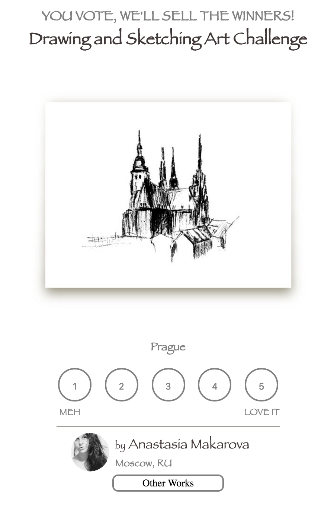
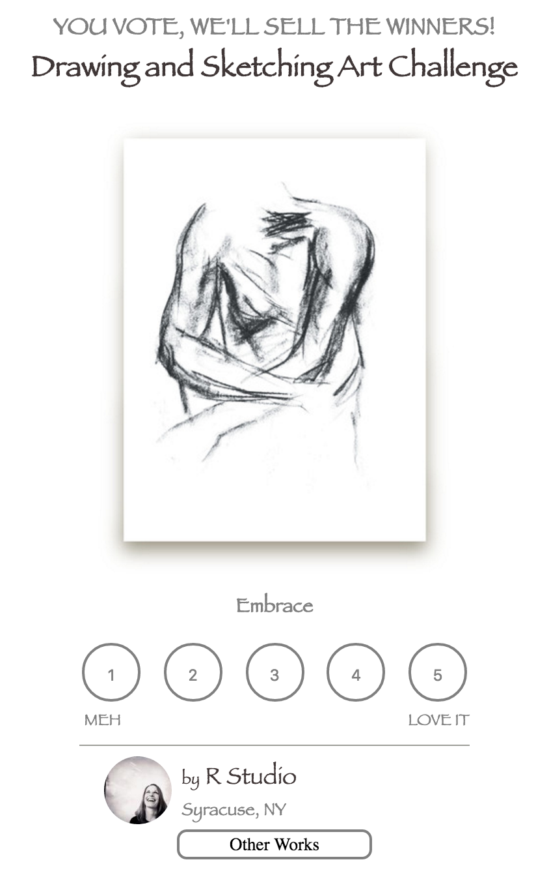

# designVoter
Web Application that lets users vote on designs

Screenshots

#Run Build
- Npm install
- Bower install
- npm run
- navigate to selected port (defaulted to localhost:3000)

#Dependencies
Node
